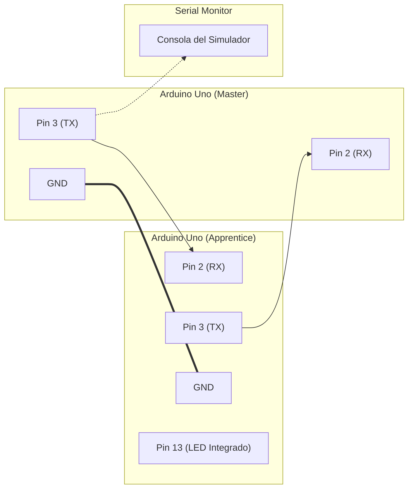
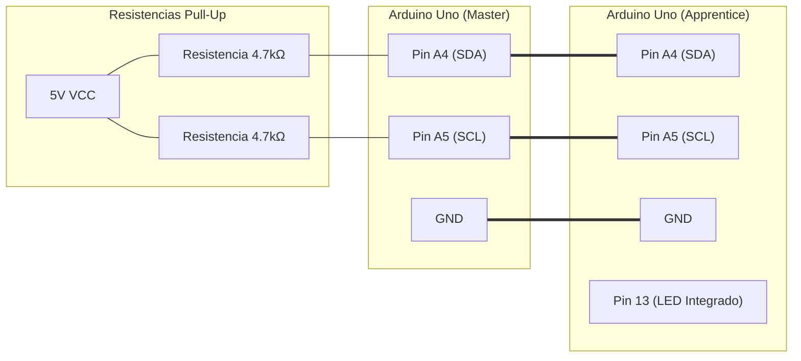
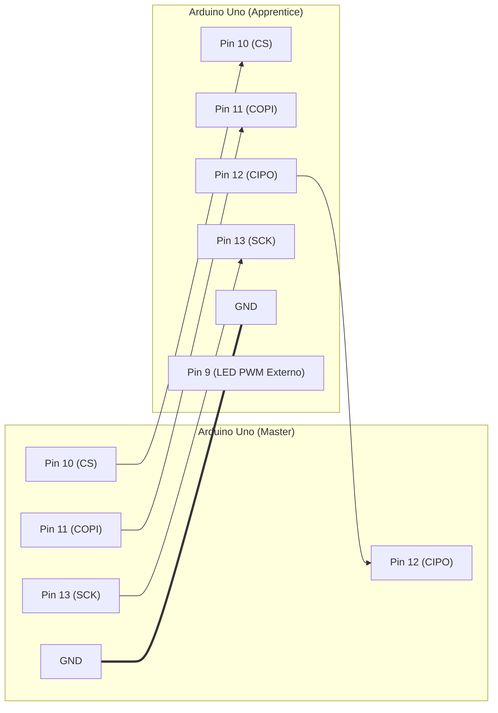

# Laboratorio #7: Comunicación entre dos Arduino Uno R3 utilizando UART, I2C y SPI en entornos simulados

Este repositorio contiene la implementación y documentación del Laboratorio #7 de Sistemas Empotrados. El objetivo del laboratorio es implementar y comparar la comunicación entre dos microcontroladores (Arduino Uno R3) bajo los roles de **Maestro** (Master) y **Aprendiz** (Apprentice) utilizando tres protocolos estándar: UART, I2C y SPI.

## CI-0155 Sistemas Empotrados de Tiempo Real — Universidad de Costa Rica

**Integrantes:** 
- Isabella Rodríguez Sánchez (C26701)
- Esteban Isaac Baires Cerdas (C10844)
- Jorge Ricardo Díaz Sagot (C12565)

---

## Estructura del Directorio

```text
lab-7-arduinos-protocol-coms/
├── README.md               <- Este archivo de documentación
├── instructions.md         <- Instrucciones originales del laboratorio
├── code/                   <- Código fuente de los proyectos de Arduino
│   ├── uart/
│   │   ├── uart_sender/    <- Código emisor UART
│   │   └── uart_receiver/  <- Código receptor UART
│   ├── i2c/
│   │   ├── i2c_master/     <- Código Maestro I2C
│   │   └── i2c_apprentice/ <- Código Aprendiz I2C
│   └── spi/
│       ├── spi_master/     <- Código Maestro SPI
│       └── spi_apprentice/ <- Código Aprendiz SPI
├── doc/                    <- Hojas técnicas y libro de arquitectura de referencia
├── simul/                  <- Archivos de simulación de Simulide (.sim1)
└── media/                  <- Capturas de pantalla y diagramas
```

---

## 1. Conexión UART (Asynchronous Serial)

La comunicación UART se implementa mediante `SoftwareSerial` en los pines digitales 2 y 3. Esto permite mantener libre el puerto de hardware serial (`Serial` / Pines 0 y 1) de cada placa para enviar mensajes de diagnóstico a sus respectivos monitores seriales en el simulador.

### Diagrama de Conexión (UART)



### Resumen de Pines

* **Maestro Pin 3 (TX)** ➡️ **Aprendiz Pin 2 (RX)**
* **Maestro Pin 2 (RX)** ⬅️ **Aprendiz Pin 3 (TX)** (Opcional, retorno)
* **GND común** (Tierra compartida)

### Tabla de Cumplimiento de Requisitos (UART)

| Requisito | Código / Implementación | Archivo de Origen |
| :--- | :--- | :--- |
| **1. Configuración de UART** | Se implementa `SoftwareSerial` en los pines 2 (RX) y 3 (TX) para dejar libres los pines de depuración por hardware. | [uart_sender.ino](code/uart/uart_sender/uart_sender.ino#L16-L22) / [uart_receiver.ino](code/uart/uart_receiver/uart_receiver.ino#L19-L27) |
| **2. Conexión de líneas TX/RX** | Cruzado de pines: Pin 3 (TX) de Emisor a Pin 2 (RX) de Receptor. | [Diagrama UART](#diagrama-de-conexión-uart) |
| **3. Roles de Emisor y Receptor** | Emisor envía periódicamente comandos alternados cada 2 segundos. Receptor los lee y actúa sobre el LED. | [uart_sender.ino](code/uart/uart_sender/uart_sender.ino#L45-L66) / [uart_receiver.ino](code/uart/uart_receiver/uart_receiver.ino#L47-L87) |
| **4. Protocolo de Comunicación** | Delimitadores de inicio/fin en formato de corchetes: `[LED_ON]` y `[LED_OFF]`. | [uart_sender.ino](code/uart/uart_sender/uart_sender.ino#L53-L56) / [uart_receiver.ino](code/uart/uart_receiver/uart_receiver.ino#L50-L67) |
| **5. Monitoreo por Serial** | Registro detallado en la consola del monitor serial en emisor y receptor. | [uart_sender.ino](code/uart/uart_sender/uart_sender.ino#L61-L64) / [uart_receiver.ino](code/uart/uart_receiver/uart_receiver.ino#L68-L82) |
| **6. Velocidad de transmisión** | Configurado a 9600 baudios, evaluando otros baud rates mediante comentarios. | [uart_sender.ino](code/uart/uart_sender/uart_sender.ino#L38-L40) / [uart_receiver.ino](code/uart/uart_receiver/uart_receiver.ino#L41-L43) |

---

## 2. Conexión I2C (Inter-Integrated Circuit)

I2C utiliza una línea de datos bidireccional (**SDA**) y una línea de reloj común (**SCL**). Se implementa con la biblioteca `Wire.h`. El Aprendiz se configura con la dirección de bus **8** (`0x08`), que es la primera dirección física válida y no reservada del estándar.

### Diagrama de Conexión (I2C)



### Resumen de Pines
* **Maestro A4 (SDA)** ➡️ **Aprendiz A4 (SDA)**
* **Maestro A5 (SCL)** ➡️ **Aprendiz A5 (SCL)**
* **GND común**
* Se utilizan resistencias de pull-up de $4.7\text{ k}\Omega$ conectadas a VCC (5V) en las líneas SDA y SCL.

### Tabla de Cumplimiento de Requisitos (I2C)

| Requisito | Código / Implementación | Archivo de Origen |
| :--- | :--- | :--- |
| **1. Configuración de pines A4/A5** | Se utiliza la librería `Wire.h` que mapea SDA en pin A4 y SCL en pin A5 por hardware. | [i2c_master.ino](code/i2c/i2c_master/i2c_master.ino#L17) / [i2c_apprentice.ino](code/i2c/i2c_apprentice/i2c_apprentice.ino#L14) |
| **2. Conexión y GND común** | Pines A4 a A4, A5 a A5 y GND a GND común. Resistencias pull-up de $4.7\text{ k}\Omega$ a 5V de cualquiera de las placas. | [Diagrama I2C](#diagrama-de-conexión-i2c) |
| **3. Dirección I2C del Aprendiz** | El aprendiz registra la dirección `8` y el maestro apunta a esta dirección. | [i2c_master.ino](code/i2c/i2c_master/i2c_master.ino#L20) / [i2c_apprentice.ino](code/i2c/i2c_apprentice/i2c_apprentice.ino#L17) |
| **4. Roles de Maestro y Aprendiz** | Maestro inicia las transferencias de lectura/escritura; Aprendiz responde mediante callbacks a eventos. | [i2c_master.ino](code/i2c/i2c_master/i2c_master.ino#L45-L85) / [i2c_apprentice.ino](code/i2c/i2c_apprentice/i2c_apprentice.ino#L31-L36) |
| **5. Dos tipos de interacción** | **Escritura (envío):** Comando `0x01` (encender) o `0x02` (apagar). <br> **Lectura (petición):** `Wire.requestFrom` solicita estado actual. | [i2c_master.ino](code/i2c/i2c_master/i2c_master.ino#L45-L65) y [i2c_master.ino](code/i2c/i2c_master/i2c_master.ino#L67-L85) |
| **6. Uso de LEDs / variables** | Control del LED en pin 13 e indicador en la variable volatile `currentLedState`. | [i2c_apprentice.ino](code/i2c/i2c_apprentice/i2c_apprentice.ino#L18-L21) / [i2c_apprentice.ino](code/i2c/i2c_apprentice/i2c_apprentice.ino#L50-L79) |
| **7. Consistencia y repetición** | Ciclo constante cada 3 segundos validado sin pérdida de datos en consola serie. | [i2c_master.ino](code/i2c/i2c_master/i2c_master.ino#L25) / [i2c_master.ino](code/i2c/i2c_master/i2c_master.ino#L41-L88) |

---

## 3. Conexión SPI (Serial Peripheral Interface)

SPI es un bus síncrono de 4 hilos de alta velocidad. Se implementa en modo full-duplex síncrono. El Aprendiz se configura a nivel de registros de bajo nivel (`SPCR`) y es controlado mediante interrupciones de hardware (`SPI_STC_vect`) para asegurar transacciones en tiempo real.

### Diagrama de Conexión (SPI)


### Resumen de Pines

* **Maestro Pin 10 (CS)** ➡️ **Aprendiz Pin 10 (CS)** (Chip Select, activo en bajo)
* **Maestro Pin 11 (COPI)** ➡️ **Aprendiz Pin 11 (COPI)** (Data Master ➡️ Apprentice)
* **Maestro Pin 12 (CIPO)** ⬅️ **Aprendiz Pin 12 (CIPO)** (Data Apprentice ➡️ Master)
* **Maestro Pin 13 (SCK)** ➡️ **Aprendiz Pin 13 (SCK)** (Clock)
* **GND común**
* **Pin 9 (PWM)** en el Aprendiz está conectado a un LED externo con una resistencia de $220\ \Omega$ a tierra para evidenciar el nivel de brillo enviado por el Maestro.

### Tabla de Cumplimiento de Requisitos (SPI)

| Requisito | Código / Implementación | Archivo de Origen |
| :--- | :--- | :--- |
| **1. Configuración de pines SPI** | COPI (Pin 11), CIPO (Pin 12), SCK (Pin 13), CS (Pin 10). | [spi_master.ino](code/spi/spi_master/spi_master.ino#L8-L11) / [spi_apprentice.ino](code/spi/spi_apprentice/spi_apprentice.ino#L10-L14) |
| **2. Conexiones y GND común** | Cableado directo en bus SPI y tierra común en simulación/físico. | [Diagrama SPI](#diagrama-de-conexión-spi) |
| **3. Roles de Maestro y Aprendiz** | Códigos separados e identificación clara de sus roles. | [spi_master.ino](code/spi/spi_master/spi_master.ino) / [spi_apprentice.ino](code/spi/spi_apprentice/spi_apprentice.ino) |
| **4. Intercambio periódico y bidireccional** | Envío de brillo del LED cada 2s. Aprendiz responde simultáneamente con su contador de transacciones. | [spi_master.ino](code/spi/spi_master/spi_master.ino#L42-L66) / [spi_apprentice.ino](code/spi/spi_apprentice/spi_apprentice.ino#L53-L61) |
| **5. Control de comportamiento por LED** | Control analógico PWM de intensidad de un LED externo en Pin 9. | [spi_apprentice.ino](code/spi/spi_apprentice/spi_apprentice.ino#L25) / [spi_apprentice.ino](code/spi/spi_apprentice/spi_apprentice.ino#L64-L75) |
| **6. Uso correcto del Pin CS** | Pin 10 configurado como salida; baja a LOW antes de transferir y sube a HIGH al terminar. | [spi_master.ino](code/spi/spi_master/spi_master.ino#L29-L31) / [spi_master.ino](code/spi/spi_master/spi_master.ino#L52-L59) |
| **7. Sincronización e integridad** | Sincronización mediante interrupción `ISR(SPI_STC_vect)` y velocidad estable a 1 MHz. | [spi_master.ino](code/spi/spi_master/spi_master.ino#L37-L38) / [spi_apprentice.ino](code/spi/spi_apprentice/spi_apprentice.ino#L41-L45) / [spi_apprentice.ino](code/spi/spi_apprentice/spi_apprentice.ino#L54-L61) |

---

## Compilación y Simulación (Arduino IDE y Simulide)

1. **Compilar el código**: Abra cada uno de los archivos `.ino` en el IDE de Arduino y compílelos (`Exportar binarias compiladas` para obtener los archivos `.hex`).
2. **Cargar Firmwares en Simulide**:
   * Monte dos placas Arduino Uno R3 en el circuito de Simulide.
   * Conecte los pines de acuerdo con los diagramas anteriores según el protocolo a probar.
   * Haga clic derecho sobre el Arduino Maestro ➡️ `Cargar firmware` ➡️ Seleccione el archivo `.hex` compilado del maestro.
   * Haga clic derecho sobre el Arduino Aprendiz ➡️ `Cargar firmware` ➡️ Seleccione el archivo `.hex` compilado del aprendiz.
   * Habilite los monitores seriales de ambos dispositivos haciendo clic derecho en cada placa y abriendo el submenú de puertos seriales del simulador.
3. **Ejecutar Simulación**: Presione el botón rojo de encendido en Simulide para verificar el flujo de comunicación bidireccional y las salidas de depuración seriales.

---

## Recursos

### Simulaciones
* [Simulación UART (simul/uart.sim1)](simul/uart.sim1)
* [Simulación SPI (simul/spi.sim1)](simul/spi.sim1)

### Videos Demostrativos
* [Video Simulación UART (media/uart-sim.mp4)](media/uart-sim.mp4)
* [Video Simulación I2C (media/i2c-sim.mp4)](media/i2c-sim.mp4)
* [Video Simulación SPI (media/spi-sim.mp4)](media/spi-sim.mp4)

